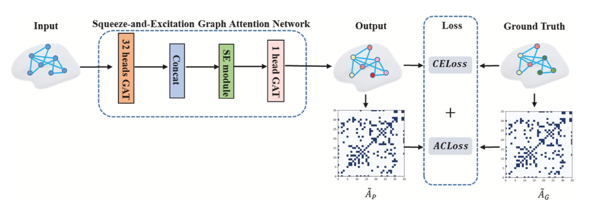

# Anatomically constrained squeeze-and-excitation graph attention network for cortical surface parcellation

Tensorflow implementation of ASEGAT designed for brain cortical surface parcellation. [[Paper](https://www.sciencedirect.com/science/article/abs/pii/S0010482521009070)]



## Requirements

TensorFlow 1.15

## Code

- sp_gat.py: main file
- gat.py: ASEGAT without SE layers

## Citation

If you find our code useful in your work, please consider using the following citation:

Li, Xinwei, et al. "[Anatomically constrained squeeze-and-excitation graph attention network for cortical surface parcellation](https://www.sciencedirect.com/science/article/abs/pii/S0010482521009070)." *Computers in Biology and Medicine* 140 (2022): 105113.

```
@article{li2022anatomically,
  title={Anatomically constrained squeeze-and-excitation graph attention network for cortical surface parcellation},
  author={Li, Xinwei and Tan, Jia and Wang, Panyu and Liu, Hong and Li, Zhangyong and Wang, Wei},
  journal={Computers in Biology and Medicine},
  volume={140},
  pages={105113},
  year={2022},
  publisher={Elsevier}
}
```


